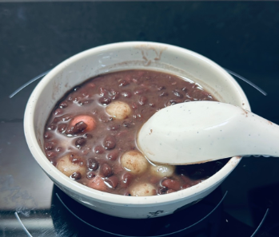
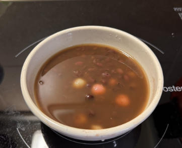
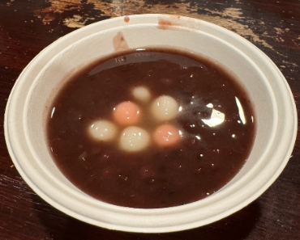
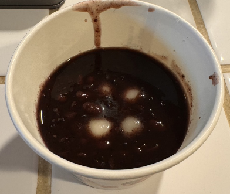
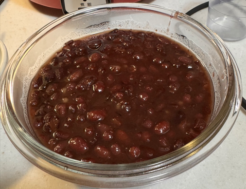

# 紅豆湯

## 教學步驟
### 紅豆湯
- 紅豆先以大火乾炒，將1:1的水分3次加入，反覆炒乾。
- 電鍋煮紅豆、水比例2:5，外鍋2杯水
- 第一次跳起(約30分)筷子翻攪悶20分鐘，再外鍋2杯水
- 第二次跳起(約30分)確定紅豆是否夠軟爛
- 加水調整到喜歡的濃稠度
- 先加一勺鹽巴，再加入糖調味

### 湯圓
- 先準備滾水，水量要夠
- 下湯圓用筷子推移，讓湯圓平均受熱
- 浮起後加入1~3次冷水
- 湯圓體積約1.5倍後濾水撈起拌砂糖

## 0509 砂糖紅豆湯

### 材料
- 紅豆300g
- 小湯圓300g
- 水(炒紅豆)300g
- 水750g
- 二砂糖30g
- 二砂糖(湯圓)30g
- 鹽巴少許
- 小湯圓300g
- 二砂糖(湯圓)30g
### 心得
- 紅豆湯：口感OK，但不夠甜
- 湯圓：不能冰，冰過會硬掉。

## 0509 黑糖紅豆湯

### 材料
- 紅豆200g
- 水(炒紅豆)200g
- 水500g
- 冰糖3大匙
- 黑糖3大匙
- 鹽巴少許
- 小湯圓200g
- 二砂糖3大匙(湯圓)30g
### 心得
- 紅豆湯：鹹鹹的不夠甜，紅豆湯不夠稠，要清爽但不能太清。
- 湯圓：這次的湯圓很成功。

## 0510 蜜紅豆湯

### 材料
- 紅豆400g
- 小湯圓200g
- 水(炒紅豆)400g
- 水1000g
- 二砂糖400g
- 鹽巴少許
- 二砂糖(湯圓)60g
### 心得
- 紅豆湯：濃稠度OK，但是太甜，湯圓分開裝OK。
- 蜜紅豆：冰過甜度OK，但是要再稠一點，否則加熱會散開。

## 0511 紫米紅豆湯

### 材料
- 耆盛紫米紅豆250g
- 砂糖125g
- 水650g
- 鹽巴少許
- 小湯圓125g
- 砂糖(小湯圓)125g
### 心得
- 紅豆湯：濃稠度OK，紫米有點太多，糖可以再少一點看看。
- 湯圓：這次湯圓有點太Q

## 0511 紅豆泥

### 材料
- 耆盛台灣紅豆(高雄10號)350g
- 砂糖350g
- 水875g
- 鹽巴少許
### 心得
這次先調味，再過篩撈起紅豆，再補充適量糖水

## 參考資料
[阿慶師暖心紅豆湯](https://www.youtube.com/watch?v=jX8RHnT2xs0&t=220s)

[蔡季芳老師蜜紅豆湯](https://www.youtube.com/watch?v=DPhaahfXnyQ)